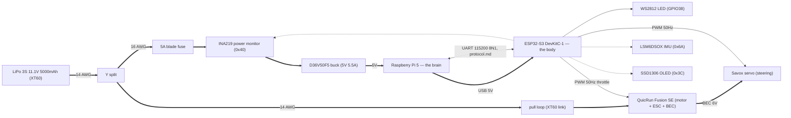

# Hardware

Single source of truth for the electrical design: how Mike is physically
wired and why. What to buy is `parts.md`; session rules and the power-off
ritual are in `CLAUDE.md`.

## Schematic

Thick edges are power, labelled with wire gauge where it matters; thin
solid edges are signals; dotted edges are the I2C bus (drawn as a star,
physically a STEMMA QT daisy chain whose order is TBD at layout). The
two Pi↔ESP edges — USB power and UART — are one physical cable. The
INA219 appears twice deliberately: it sits in series in the electronics
power branch and is read over I2C.

## Power

Topology: battery (Gens Ace 3S 11.1V 5000mAh, XT60) → trunk → Y split,
then two branches:

- ESC branch: Y → pull loop → Fusion SE (motor + ESC + BEC). 14 AWG.
- Electronics branch: Y → 5A fuse → INA219 → D36V50F5 buck → Pi 5.
  16 AWG. The ESP32 is powered from the Pi's USB — one power source at a
  time on the devkit, never USB and the 5V pin together.

Rules:

- Trunk (battery → Y) is 14 AWG and must never be thinner than the
  fattest branch — branch currents sum in it. Keep it short: Y close to
  the battery tray.
- Silicone-insulated tinned wire throughout; adhesive-lined heat shrink
  on the Y joints (salt-air seal). Genuine Amass XT60s only.
- Common ground everywhere; motor current never through USB ground. The Y
  is the star point — motor return current flows battery-ward, never
  through the electronics branch.

### Pull loop

In the ESC branch, not pre-split: pulling it guarantees stillness while
the Pi stays up — no unclean shutdowns, and the drivetrain is physically
dead for bench flashing/testing. The battery's own XT60 remains the
master everything-off disconnect.

Construction: the harness carries a male XT60 with + entering one contact
and leaving the other; the key is a female XT60 bridged with 14 AWG. Key
gender matters: the battery is female, so a female key cannot mate it — a
bridged key that fits the battery is a dead short across the LiPo.

### Fuse

5A mini blade in an inline holder, first thing after the Y on the
electronics branch. Protects that wire from a chafe-through short; normal
draw is ≤ ~2.5A at 11.1V, so it never blows in service. The motor branch
is unfused, RC-style — its wire is sized for the load.

### Servo power

The servo is NOT on battery power: it runs from the Fusion SE's BEC via
the receiver-style lead. Verify the BEC rating against the Savox stall
draw (3–5A for big steel-gear servos); fit a standalone 6V BEC if
marginal. From the ESC lead only signal and ground go to the ESP32 — BEC
+6V never touches an ESP pin.

## I2C bus

STEMMA QT daisy-chain off the ESP32. All breakouts are 3.3V with onboard
pull-ups; no address conflicts.

- `0x40` — INA219 power monitor. Battery voltage (LiPo low-voltage
  disarm) + electronics-rail current. Wired high-side in the electronics
  branch after the Y split — motor current must NOT pass through it
  (±3.2A max).
- `0x6A` — LSM6DSOX IMU. Tilt safety, and "commanded to move but nothing
  shaking" stall proxy.
- `0x3C` — SSD1306 128x64 OLED status display.
