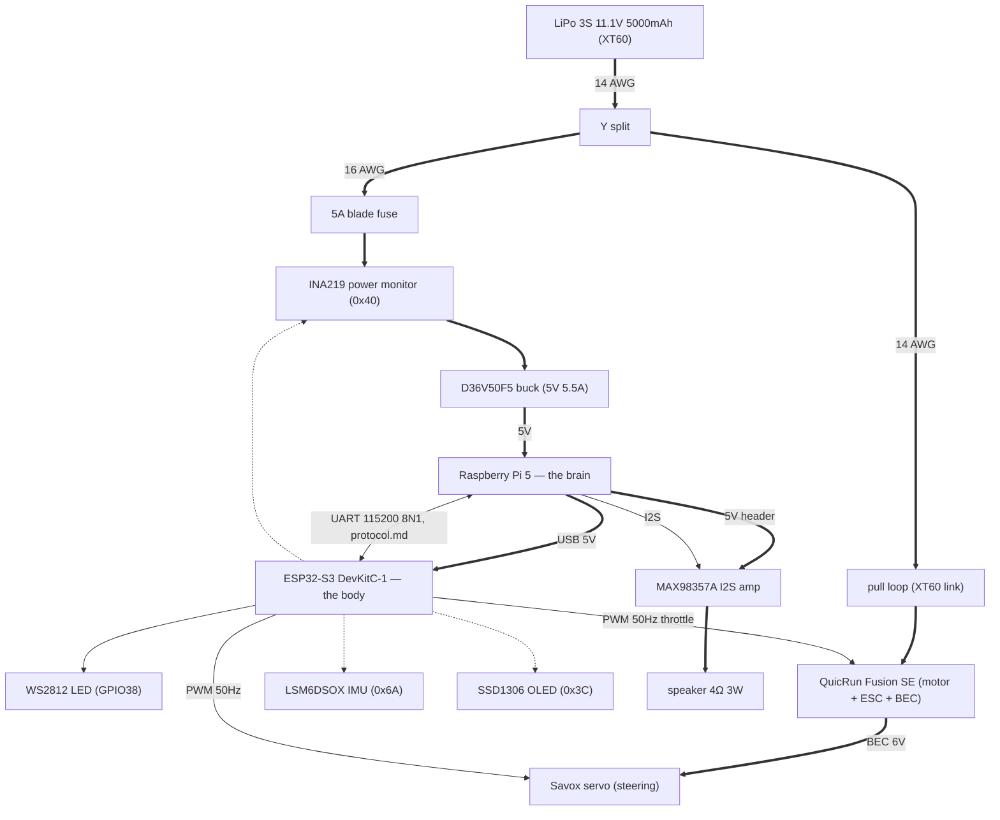
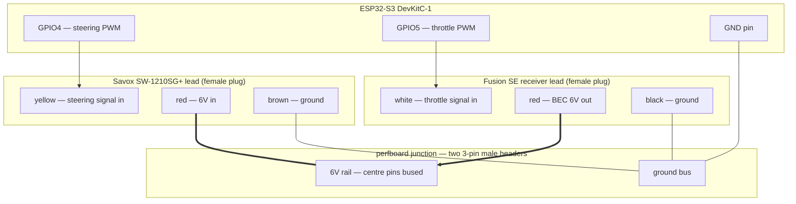

# Hardware

Single source of truth for the electrical design: how Mike is physically
wired and why. What to buy is `parts.md`; session rules and the power-off
ritual are in `CLAUDE.md`.

## Schematic

Thick edges are power, labelled with wire gauge where it matters; thin
solid edges are signals; dotted edges are the I2C bus (drawn as a star,
physically a STEMMA QT daisy chain whose order is TBD at layout). The
two Pi↔ESP edges — USB power and UART — are one physical cable. The
INA219 appears twice deliberately: it sits in series in the electronics
power branch and is read over I2C.

## Power

Topology: battery (Gens Ace 3S 11.1V 5000mAh, XT60) → trunk → Y split,
then two branches:

- ESC branch: Y → pull loop → Fusion SE (motor + ESC + BEC). 14 AWG.
- Electronics branch: Y → 5A fuse → INA219 → D36V50F5 buck → Pi 5.
  16 AWG. The ESP32 is powered from the Pi's USB — one power source at a
  time on the devkit, never USB and the 5V pin together.

Rules:

- Trunk (battery → Y) is 14 AWG and must never be thinner than the
  fattest branch — branch currents sum in it. Keep it short: Y close to
  the battery tray.
- Silicone-insulated tinned wire throughout; adhesive-lined heat shrink
  on the Y joints (salt-air seal). Genuine Amass XT60s only.
- Common ground everywhere; motor current never through USB ground. The Y
  is the star point — motor return current flows battery-ward, never
  through the electronics branch.

### Pull loop

In the ESC branch, not pre-split: pulling it guarantees stillness while
the Pi stays up — no unclean shutdowns, and the drivetrain is physically
dead for bench flashing/testing. The battery's own XT60 remains the
master everything-off disconnect.

Construction: the harness carries a male XT60 with + entering one contact
and leaving the other; the key is a female XT60 bridged with 14 AWG. Key
gender matters: the battery is female, so a female key cannot mate it — a
bridged key that fits the battery is a dead short across the LiPo.

### Fuse

5A mini blade in an inline holder, first thing after the Y on the
electronics branch. Protects that wire from a chafe-through short; normal
draw is ≤ ~2.5A at 11.1V, so it never blows in service. The motor branch
is unfused, RC-style — its wire is sized for the load.

### Servo power and the junction

The servo is NOT on battery power: it runs from the Fusion SE's BEC.
Ratings (verified 2026-07-21): BEC 6V or 7.4V (set via the program box —
use 6V) at 4A continuous, 6A peak; Savox SW-1210SG+ stall 6A at 6V,
7.4A at 7.4V; torque 20kg·cm at 6V, 32 at 7.4V (the + variant's
soft-start and Sanwa SSR support change none of these numbers). At 6V, hard stall sits at the
BEC's peak rating and normal steering far below — adequate, and 20kg·cm
is ample. 7.4V would buy torque we don't need at a stall the BEC can't
cover.

In a stock RC car both 3-wire leads plug into the receiver, which is
secretly a power/signal bus: grounds joined, centre (+) pins joined,
signal pins individual. Mike has no receiver, so a perfboard junction
plays the part — two 3-pin 0.1" male headers, RC pinout (signal / + / −,
+ in the middle so a reversed plug swaps ground and signal, never puts
6V on a signal):

- All − pins bused, plus one wire to ESP ground. Signal reference only —
  motor current returns via the fat XT60 path, never this wire.
- All + (centre) pins bused: the 6V rail. The ESC's BEC feeds it, the
  servo draws from it. It never touches an ESP pin — the ESP32 is 3.3V
  logic.
- Signal pins wired individually to ESP GPIOs — GPIO4 steering, GPIO5
  throttle (see pin map below). ESP 3.3V PWM is read fine by modern ESCs
  and digital servos; a level shifter is the (unlikely) fallback.

Wire by wire (red is the centre pin on both leads):

Thick edges are the 6V path — the BEC feeds the rail, the servo draws
from it; plain edges are ground; arrows are the two PWM signals. Both
female plugs push straight onto the junction's male headers; every wire
lands there. The two signal pins pass through the junction to the ESP
GPIOs — nothing else reaches the ESP.

Escape hatch: if the BEC ever proves inadequate, pull the ESC centre pin
from the junction and feed the rail from a standalone 6V UBEC — nothing
else changes.

The Fusion SE's 5-wire PRG lead is the port for Hobbywing's LED program
box: bench-only configuration (LiPo cutoff — set it, it backs up the
INA219 disarm; drag brake; run mode; BEC voltage). Not runtime wiring.

## Audio

Voice out. Lives on the Pi — speech is persona, and the persona is the
brain's job (`CLAUDE.md`); the ESP32 never touches audio.

- Adafruit MAX98357A I2S mono amp breakout on the Pi's header: BCLK →
  GPIO18, LRCLK → GPIO19, DIN → GPIO21, power from the header's 5V and
  GND pins. `dtoverlay=max98357a` in `/boot/firmware/config.txt`
  presents it as a normal ALSA device — the voice software plays to the
  ALSA default and never knows what the hardware is.
- Those are the Pi's dedicated I2S pins; every sensor hangs off the ESP,
  so the Pi header is otherwise free.
- Speaker: 4Ω 3W bare cone on the breakout's screw terminal. Peak into
  4Ω at 5V is ~3.2W — under 0.8A from the 5V rail, brief and rare
  (speech duty is low), inside the buck's headroom. The 3" cone is a
  bench/first-shell part; swap for a weather-resistant (mylar cone)
  speaker at shell layout if the beach demands it.
- Mono, deliberately: one rover, one voice. The breakout's default
  (L+R)/2 downmix is fine.

## I2C bus

STEMMA QT daisy-chain off the ESP32. All breakouts are 3.3V with onboard
pull-ups; no address conflicts.

- `0x40` — INA219 power monitor. Battery voltage (LiPo low-voltage
  disarm) + electronics-rail current. Wired high-side in the electronics
  branch after the Y split — motor current must NOT pass through it
  (±3.2A max).
- `0x6A` — LSM6DSOX IMU. Tilt safety, and "commanded to move but nothing
  shaking" stall proxy.
- `0x3C` — SSD1306 128x64 OLED status display.

## ESP32-S3 pin map

| GPIO | use |
|---|---|
| 4 | steering servo PWM (LEDC, 50 Hz) |
| 5 | throttle PWM to Fusion SE (LEDC, 50 Hz) |
| 8 | I2C SDA (STEMMA QT daisy chain) |
| 9 | I2C SCL (STEMMA QT daisy chain) |
| 38 | onboard WS2812 LED (GPIO48 on some board revisions) |

Keep clear: GPIO26–37 (flash and PSRAM on the WROOM-1 N8R8 module),
strapping pins 0, 3, 45, 46; GPIO19/20 are the native USB port (the
future console channel).
